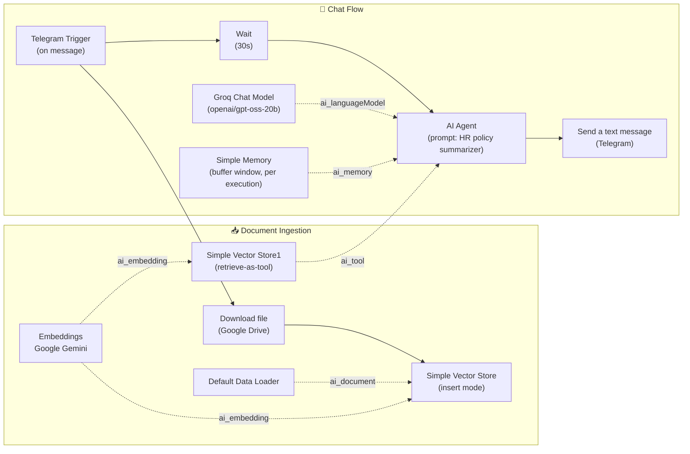

# 📄 HR Policy AI Agent — Telegram RAG Bot (n8n)

An n8n workflow that turns a PDF document (e.g. an HR Policy manual) into a
**Retrieval-Augmented Generation (RAG) chatbot** accessible through Telegram.
Users send a question to a Telegram bot, and the bot answers based on the
content of the uploaded document, using an in-memory vector store, Google
Gemini embeddings, and a Groq-hosted LLM as the reasoning engine.

## 🧠 How it works

1. A **Telegram message** triggers the workflow.
2. The source **PDF is downloaded from Google Drive** and loaded into an
   **in-memory vector store**, using **Google Gemini** to generate embeddings
   for each document chunk.
3. A short **Wait** step gives the indexing step time to finish before the
   agent runs.
4. The **AI Agent** (powered by a **Groq-hosted LLM**, `openai/gpt-oss-20b`)
   receives the user's message, uses the vector store as a **retrieval tool**
   to look up relevant policy text, and keeps short-term conversational
   context via a **buffer window memory** (keyed by execution id).
5. The agent's answer (capped at ~200 words per the prompt) is **sent back to
   the user via Telegram**.

## 🗺️ Architecture diagram

**Legend:** solid arrows = main data flow, dashed arrows = LangChain
sub-connections (model / memory / tool / embeddings / document loader) feeding
into the corresponding node.

## ⚙️ Nodes used

| Node | Type | Role |
|---|---|---|
| Telegram Trigger | `n8n-nodes-base.telegramTrigger` | Entry point — fires on new Telegram messages |
| Download file | `n8n-nodes-base.googleDrive` | Downloads the source PDF from Google Drive |
| Default Data Loader | `@n8n/n8n-nodes-langchain.documentDefaultDataLoader` | Parses the binary file into document chunks |
| Embeddings Google Gemini | `@n8n/n8n-nodes-langchain.embeddingsGoogleGemini` | Generates embeddings for indexing & retrieval |
| Simple Vector Store | `@n8n/n8n-nodes-langchain.vectorStoreInMemory` | Stores document embeddings (insert mode) |
| Simple Vector Store1 | `@n8n/n8n-nodes-langchain.vectorStoreInMemory` | Exposed to the agent as a retrieval **tool** |
| Wait | `n8n-nodes-base.wait` | Small delay so indexing completes before the agent queries the store |
| AI Agent | `@n8n/n8n-nodes-langchain.agent` | Orchestrates the LLM, memory, and retrieval tool |
| Groq Chat Model | `@n8n/n8n-nodes-langchain.lmChatGroq` | LLM backend (`openai/gpt-oss-20b` via Groq) |
| Simple Memory | `@n8n/n8n-nodes-langchain.memoryBufferWindow` | Keeps short-term chat context per execution |
| Send a text message | `n8n-nodes-base.telegram` | Sends the agent's reply back to the user |

> Note: an `Embeddings OpenAI` node exists in the workflow but is currently
> unused/disconnected — it's a leftover from testing and can be removed.

## 🔑 Required credentials

You'll need to create these credentials **yourself** in your own n8n instance
(none are included in this repo — see [Setup](#-setup) below):

| Service | Credential type in n8n | Where to get it |
|---|---|---|
| Telegram Bot | `telegramApi` | [@BotFather](https://t.me/BotFather) on Telegram |
| Google Drive | `googleDriveOAuth2Api` | [Google Cloud Console](https://console.cloud.google.com/) OAuth2 client |
| Google Gemini | `googlePalmApi` | [Google AI Studio](https://aistudio.google.com/) API key |
| Groq | `groqApi` | [Groq Console](https://console.groq.com/) API key |

## 🚀 Setup

1. Import `HR_Policy_AI_Agent_Telegram_Bot.json` into your n8n instance
   (**Workflows → Import from File**).
2. Create the four credentials listed above in **n8n → Credentials**.
3. Open each node below and attach the matching credential:
   - `Telegram Trigger` and `Send a text message` → your Telegram credential
   - `Download file` → your Google Drive credential
   - `Embeddings Google Gemini` → your Gemini credential
   - `Groq Chat Model` → your Groq credential
4. In the `Download file` node, replace the placeholder file reference with
   your own Google Drive file (the document you want the bot to answer
   questions about).
5. Adjust the `AI Agent` system prompt if you want to point it at a different
   type of document than "HR policy."
6. Activate the workflow and message your Telegram bot to test it.

## ⚠️ Security notes

This repository's workflow JSON has had the following removed/replaced with
placeholders before publishing:
- All credential IDs (Telegram, Google Drive, Gemini, Groq)
- Internal n8n webhook IDs
- The real Google Drive file ID/URL and original document filename
- The n8n instance ID

No real API keys were ever present in the exported file — n8n stores
credential secrets encrypted on the server side, not in the workflow JSON —
but the above identifiers were still scrubbed as good practice before making
this public. The workflow is also set to `"active": false` by default so it
doesn't run unexpectedly on import.

## 📌 Possible improvements

- Replace fixed `Wait (30s)` with a proper wait-for-completion signal from the
  indexing branch, so short/long documents don't cause timing issues.
- Persist the vector store (e.g. Pinecone, Qdrant, Supabase) instead of
  in-memory, so the index survives workflow restarts.
- Remove the unused `Embeddings OpenAI` node.

## 📝 License

MIT — feel free to reuse and adapt.
